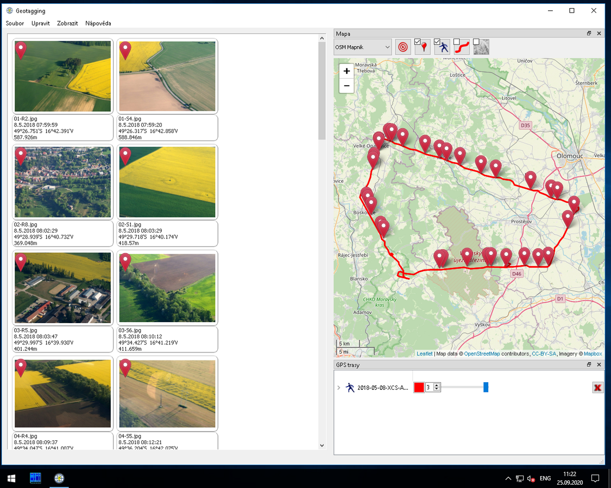
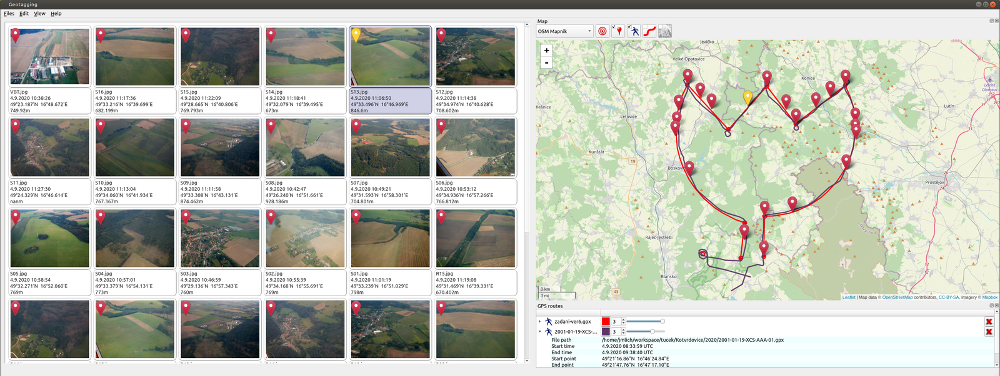

# Installation

* Windows - download exe file from releases section
* Fedora - add COPR repository and install rpms
* Other Linux - use flatpak

# Contribute

* Translate to your language at [transifex](https://www.transifex.com/jozef-mlich/geotagging/dashboard/).
* Feel free to open issue
* Feel free to create merge request 

# Screenshots

# Video tutorial

www.fit.vutbr.cz/study/DP/BP.php.cs?id=11578
